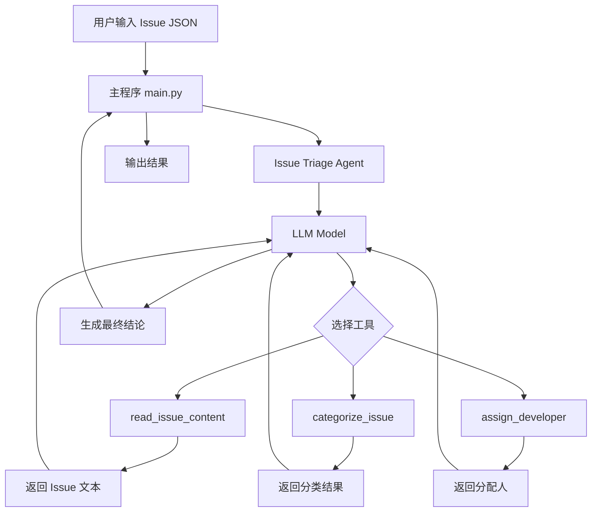

# Design Document - GitHub Issue 自动分诊 Agent

## Overview

本项目将构建一个基于 LangChain 和 LangGraph 的 GitHub Issue 自动分诊系统。系统采用 ReAct Agent 模式，通过定义明确的工具函数，让 LLM 自主思考并执行 Issue 的读取、分类和分配流程。

### 核心设计理念

1. **工具驱动架构**：将复杂任务分解为独立的工具函数，每个工具负责单一职责
2. **LLM 自主决策**：使用 ReAct Agent 让 LLM 自主决定工具调用顺序和参数
3. **可扩展设计**：通过配置化的分类规则和分配策略，支持快速扩展新类型
4. **清晰的工具描述**：精心设计的工具描述确保 LLM 能准确理解和使用工具

### 技术栈

- **框架**: LangChain 0.3.27+, LangGraph 0.6.7+
- **LLM 提供商**: 支持 OpenAI 和 Anthropic (通过环境变量配置)
- **Python 版本**: 3.11+
- **依赖管理**: uv (pyproject.toml)

## Architecture

### 系统架构图



### 模块结构

```
backend/src/issue_agent/
├── __init__.py              # 模块导出
├── agent.py                 # 主 Agent 实现
├── tools.py                 # 所有工具函数（read_issue_content, categorize_issue, assign_developer）
├── config.py                # 分类和分配配置
├── models.py                # 数据模型定义
└── main.py                  # 主程序入口和示例

backend/
├── README_ISSUE_AGENT.md    # Issue Agent 专用文档
└── ...
```

**模块说明**:
- `issue_agent/`: 独立的 agent 模块，包含所有相关代码
- `agent.py`: Agent 的主入口，包含 Agent 创建和配置
- `tools.py`: 所有工具函数的实现（单文件包含所有工具）
- `config.py`: 配置文件，包括分类规则和分配策略（单文件）
- `models.py`: 数据模型和类型定义（单文件）
- `main.py`: 主程序入口，包含示例 Issue 数据和运行逻辑

## Components and Interfaces

### 1. Issue Reader Tool (read_issue_content)

**职责**: 从 Issue JSON 数据中提取和格式化内容

**函数签名**:
```python
@tool
def read_issue_content(issue_data: dict) -> str:
    """从 GitHub Issue 数据中提取标题和描述内容。
    
    此工具用于解析 Issue JSON 对象，提取关键信息并格式化为
    便于后续分析的文本格式。
    
    Args:
        issue_data: Issue 的 JSON 数据，应包含 'title' 和 'body' 字段
        
    Returns:
        格式化的 Issue 内容字符串，包含标题和正文
        
    Example:
        issue = {"title": "Bug: App crashes", "body": "When I click..."}
        content = read_issue_content(issue)
        # Returns: "Title: Bug: App crashes\n\nBody: When I click..."
    """
```

**实现逻辑**:
1. 验证 issue_data 是否为字典类型
2. 检查必需字段 'title' 和 'body' 是否存在
3. 提取并清理文本内容（去除多余空白）
4. 格式化为统一的文本格式
5. 处理异常情况（缺失字段、空值等）

**错误处理**:
- 缺少 title 或 body 字段：返回错误信息
- issue_data 不是字典：返回类型错误信息
- 字段值为 None 或空字符串：使用默认值 "N/A"

### 2. Issue Classifier Tool (categorize_issue)

**职责**: 使用 LLM 分析 Issue 内容并分类

**函数签名**:
```python
@tool
def categorize_issue(text_content: str) -> str:
    """将 Issue 内容分类为 Bug、Feature Request 或 Question。
    
    此工具使用 LLM 分析 Issue 的文本内容，根据内容特征判断
    Issue 的类型。这是分诊流程中的核心工具。
    
    分类标准：
    - Bug: 报告软件错误、异常、崩溃或非预期行为
    - Feature Request: 建议新功能、改进或增强
    - Question: 询问使用方法、寻求帮助或澄清疑问
    
    Args:
        text_content: Issue 的文本内容（通常来自 read_issue_content）
        
    Returns:
        分类结果，必须是以下之一: "Bug", "Feature Request", "Question"
        
    Example:
        content = "Title: App crashes on startup\nBody: Stack trace..."
        category = categorize_issue(content)
        # Returns: "Bug"
    """
```

**实现逻辑**:
1. 构建专门的分类 Prompt，包含：
   - 明确的分类定义和示例
   - 分类决策的关键特征
   - 输出格式要求（只返回分类名称）
2. 调用 LLM 进行分类
3. 解析 LLM 响应，提取分类结果
4. 验证分类结果是否在允许的类别中
5. 返回标准化的分类字符串

**Prompt 设计**:
```
你是一个 GitHub Issue 分类专家。请根据以下 Issue 内容，将其分类为以下三种类型之一：

1. Bug - 软件错误或缺陷
   特征：错误信息、异常堆栈、崩溃报告、非预期行为、"不工作"、"失败"等
   
2. Feature Request - 新功能请求或改进建议
   特征：建议、希望、应该添加、改进、增强、新功能等
   
3. Question - 使用问题或疑问
   特征：如何、为什么、怎样、询问、不理解、求助等

Issue 内容：
{text_content}

请只返回分类名称（Bug、Feature Request 或 Question），不要包含其他内容。
```

**错误处理**:
- LLM 返回无效分类：默认返回 "Question"
- LLM 调用失败：捕获异常并返回错误信息
- 空文本内容：返回错误提示

### 3. Developer Assigner Tool (assign_developer)

**职责**: 根据 Issue 分类分配合适的开发者

**函数签名**:
```python
@tool
def assign_developer(category: str) -> str:
    """根据 Issue 分类分配负责的开发者。
    
    此工具根据预定义的分配规则，为不同类型的 Issue 分配
    合适的开发者或团队成员。
    
    分配规则：
    - Bug -> 负责 Bug 修复的开发者
    - Feature Request -> 负责新功能开发的开发者
    - Question -> 负责技术支持的开发者
    
    Args:
        category: Issue 分类（来自 categorize_issue 工具）
        
    Returns:
        被分配开发者的名称
        
    Example:
        developer = assign_developer("Bug")
        # Returns: "张三"
    """
```

**实现逻辑**:
1. 从配置中加载分配规则字典
2. 根据 category 查找对应的开发者
3. 如果分类不存在，返回默认分配人
4. 返回开发者名称

**配置结构** (config.py):
```python
DEVELOPER_ASSIGNMENT = {
    "Bug": "张三",
    "Feature Request": "李四",
    "Question": "王五",
    "Documentation": "赵六",  # 可扩展
}

DEFAULT_ASSIGNEE = "项目负责人"
```

**错误处理**:
- 未知分类：返回默认分配人
- 空分类字符串：返回错误信息

### 4. Issue Triage Agent

**职责**: 协调工具调用，完成端到端的分诊流程

**实现方式**: 使用 LangGraph 的 `create_react_agent`

**Agent 配置**:
```python
agent = create_react_agent(
    model=model,  # 支持 OpenAI 或 Anthropic
    tools=[
        read_issue_content,
        categorize_issue,
        assign_developer,
    ],
    prompt=TRIAGE_AGENT_PROMPT,
)
```

**System Prompt 设计**:
```
你是一个 GitHub Issue 自动分诊助手。你的任务是分析 Issue 并完成以下流程：

1. 使用 read_issue_content 工具读取 Issue 的标题和描述
2. 使用 categorize_issue 工具将 Issue 分类为 Bug、Feature Request 或 Question
3. 使用 assign_developer 工具根据分类结果分配合适的开发者

工作流程：
- 首先调用 read_issue_content 获取 Issue 内容
- 然后调用 categorize_issue 对内容进行分类
- 最后调用 assign_developer 分配开发者
- 完成后，总结分诊结果

输出格式：
分诊完成！
- Issue 类型: [分类]
- 分配给: [开发者名称]
- 建议优先级: [根据类型建议]

请按照这个流程执行，确保每个步骤都完成后再进行下一步。
```

## Data Models

### Issue JSON Schema

```python
from typing import TypedDict, Optional

class IssueData(TypedDict):
    """GitHub Issue 数据结构"""
    title: str              # Issue 标题（必需）
    body: str               # Issue 描述正文（必需）
    number: Optional[int]   # Issue 编号（可选）
    author: Optional[str]   # 作者（可选）
    labels: Optional[list[str]]  # 现有标签（可选）
    created_at: Optional[str]    # 创建时间（可选）
```

**示例数据**:
```python
SAMPLE_BUG_ISSUE = {
    "title": "应用启动时崩溃",
    "body": """
    当我尝试启动应用时，它立即崩溃并显示以下错误：
    
    ```
    TypeError: Cannot read property 'map' of undefined
    at App.render (App.js:45)
    ```
    
    复现步骤：
    1. 打开应用
    2. 应用立即崩溃
    
    环境：
    - 版本: 1.2.3
    - 操作系统: Windows 11
    """,
    "number": 123,
    "author": "user123"
}

SAMPLE_FEATURE_ISSUE = {
    "title": "添加暗色模式支持",
    "body": """
    希望应用能够支持暗色模式。
    
    建议：
    - 添加主题切换按钮
    - 自动跟随系统主题
    - 保存用户偏好设置
    
    这将大大提升夜间使用体验。
    """,
    "number": 124,
    "author": "user456"
}

SAMPLE_QUESTION_ISSUE = {
    "title": "如何配置数据库连接？",
    "body": """
    我是新用户，想知道如何正确配置数据库连接。
    
    我尝试了以下配置但不工作：
    ```
    DB_HOST=localhost
    DB_PORT=5432
    ```
    
    文档中没有找到详细说明，能否提供帮助？
    """,
    "number": 125,
    "author": "user789"
}
```

### Triage Result Schema

```python
class TriageResult(TypedDict):
    """分诊结果数据结构"""
    issue_number: Optional[int]
    category: str           # Bug, Feature Request, Question
    assigned_to: str        # 开发者名称
    confidence: str         # 分类置信度（可选）
    reasoning: str          # 分类理由（可选）
```

## Error Handling

### 错误类型和处理策略

1. **输入验证错误**
   - 场景：Issue JSON 格式不正确或缺少必需字段
   - 处理：在 read_issue_content 中捕获并返回清晰的错误信息
   - 示例：`"错误：Issue 数据缺少 'title' 字段"`

2. **LLM 调用错误**
   - 场景：API 调用失败、超时或配额不足
   - 处理：捕获异常，记录错误日志，返回友好的错误信息
   - 降级策略：使用基于关键词的简单分类作为后备

3. **分类结果无效**
   - 场景：LLM 返回不在预定义类别中的结果
   - 处理：验证分类结果，无效时默认为 "Question"
   - 日志：记录原始 LLM 响应用于调试

4. **配置错误**
   - 场景：分配规则配置缺失或格式错误
   - 处理：使用默认分配人，记录警告日志
   - 验证：启动时验证配置完整性

### 错误处理实现

```python
class TriageError(Exception):
    """分诊过程中的基础异常类"""
    pass

class InvalidIssueDataError(TriageError):
    """Issue 数据无效"""
    pass

class ClassificationError(TriageError):
    """分类失败"""
    pass

# 在工具中使用
try:
    # 工具逻辑
    pass
except Exception as e:
    logger.error(f"Tool execution failed: {e}")
    return f"错误：{str(e)}"
```

## Testing Strategy

### 1. 单元测试

**测试工具函数**:
```python
# tests/test_tools.py

def test_read_issue_content_valid():
    """测试正常的 Issue 数据读取"""
    issue = {"title": "Test", "body": "Content"}
    result = read_issue_content.invoke(issue)
    assert "Test" in result
    assert "Content" in result

def test_read_issue_content_missing_field():
    """测试缺少必需字段的情况"""
    issue = {"title": "Test"}
    result = read_issue_content.invoke(issue)
    assert "错误" in result or "error" in result.lower()

def test_assign_developer_known_category():
    """测试已知分类的开发者分配"""
    result = assign_developer.invoke("Bug")
    assert result == "张三"

def test_assign_developer_unknown_category():
    """测试未知分类的默认分配"""
    result = assign_developer.invoke("Unknown")
    assert result == "项目负责人"
```

### 2. 集成测试

**测试 Agent 完整流程**:
```python
# tests/test_agent.py

def test_agent_bug_triage():
    """测试 Bug Issue 的完整分诊流程"""
    issue = SAMPLE_BUG_ISSUE
    result = agent.invoke({"messages": [("user", json.dumps(issue))]})
    
    # 验证结果包含预期信息
    final_message = result["messages"][-1].content
    assert "Bug" in final_message
    assert "张三" in final_message

def test_agent_feature_request_triage():
    """测试 Feature Request 的完整分诊流程"""
    issue = SAMPLE_FEATURE_ISSUE
    result = agent.invoke({"messages": [("user", json.dumps(issue))]})
    
    final_message = result["messages"][-1].content
    assert "Feature Request" in final_message
    assert "李四" in final_message
```

### 3. Prompt 测试

**测试分类 Prompt 的准确性**:
```python
# tests/test_classification.py

def test_classification_accuracy():
    """测试分类准确性"""
    test_cases = [
        (SAMPLE_BUG_ISSUE, "Bug"),
        (SAMPLE_FEATURE_ISSUE, "Feature Request"),
        (SAMPLE_QUESTION_ISSUE, "Question"),
    ]
    
    for issue, expected_category in test_cases:
        content = read_issue_content.invoke(issue)
        category = categorize_issue.invoke(content)
        assert category == expected_category
```

### 4. 边界测试

- 空 Issue 内容
- 超长 Issue 文本
- 特殊字符和 Unicode
- 多语言 Issue（中英文混合）
- 模糊的分类边界情况

## Extensibility Design

### 添加新分类的步骤

**场景**: 添加 "Documentation" 分类

1. **更新配置** (issue_agent/config.py):
```python
DEVELOPER_ASSIGNMENT = {
    "Bug": "张三",
    "Feature Request": "李四",
    "Question": "王五",
    "Documentation": "赵六",  # 新增
}

VALID_CATEGORIES = [
    "Bug",
    "Feature Request", 
    "Question",
    "Documentation",  # 新增
]
```

2. **更新分类 Prompt** (issue_agent/tools.py):
```python
CLASSIFICATION_PROMPT = """
...
4. Documentation - 文档相关的问题或改进
   特征：文档错误、文档缺失、API 文档、教程、示例等
...
"""
```

3. **添加测试用例** (issue_agent/main.py):
```python
SAMPLE_DOCUMENTATION_ISSUE = {
    "title": "API 文档缺少示例",
    "body": "用户认证 API 的文档中没有代码示例..."
}
```

4. **无需修改**:
   - Agent 主逻辑 (agent.py)
   - 工具函数签名
   - 主程序流程

### 配置化设计

**支持通过配置文件扩展**:
```python
# issue_agent/config.py

from typing import Dict, List

class TriageConfig:
    """分诊配置类"""
    
    def __init__(self):
        self.categories: List[str] = [
            "Bug",
            "Feature Request",
            "Question",
        ]
        
        self.assignments: Dict[str, str] = {
            "Bug": "张三",
            "Feature Request": "李四",
            "Question": "王五",
        }
        
        self.default_assignee: str = "项目负责人"
    
    def add_category(self, category: str, assignee: str):
        """动态添加新分类"""
        if category not in self.categories:
            self.categories.append(category)
        self.assignments[category] = assignee
    
    def get_assignee(self, category: str) -> str:
        """获取分配人"""
        return self.assignments.get(category, self.default_assignee)

# 全局配置实例
config = TriageConfig()
```

## Performance Considerations

1. **LLM 调用优化**
   - 使用较小的模型（如 gpt-4o-mini）降低延迟和成本
   - 设置合理的 timeout 和 retry 策略
   - 考虑批量处理多个 Issue

2. **缓存策略**
   - 对相似 Issue 的分类结果进行缓存
   - 使用 LangChain 的缓存机制

3. **并发处理**
   - 支持异步处理多个 Issue
   - 使用 LangGraph 的流式输出

## Security Considerations

1. **输入验证**
   - 验证 Issue JSON 结构
   - 限制文本长度防止过大输入
   - 清理潜在的注入攻击

2. **API 密钥管理**
   - 使用环境变量存储 API 密钥
   - 不在日志中输出敏感信息

3. **输出过滤**
   - 确保 LLM 输出不包含敏感信息
   - 验证分类结果在允许范围内

## Deployment Considerations

1. **环境配置**
   - 支持 .env 文件配置
   - 支持多个 LLM 提供商切换

2. **日志记录**
   - 记录每次分诊的完整轨迹
   - 记录工具调用和 LLM 响应

3. **监控指标**
   - 分类准确率
   - 平均处理时间
   - API 调用成本

## Future Enhancements

1. **高级功能**
   - 自动添加 GitHub 标签
   - 优先级评估
   - 相似 Issue 检测
   - 多语言支持

2. **机器学习优化**
   - 基于历史数据微调分类模型
   - 学习开发者的专长领域

3. **集成能力**
   - GitHub Webhook 集成
   - Slack/Teams 通知
   - 项目管理工具集成
